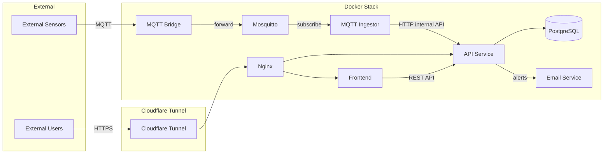

# Architecture Overview

This document describes the high-level architecture of the MPT.MQTT_Server system: services, data flow, and deployment.

## Services

| Service        | Port(s)     | Purpose                                      |
|----------------|-------------|----------------------------------------------|
| MQTT Bridge    | (internal)  | Forwards messages from external broker to internal |
| Mosquitto      | 1883, 8883, 9001, 9443 | Internal MQTT broker                    |
| MQTT Ingestor  | 9003        | Subscribes to MQTT, validates and stores via API |
| API Service    | 9002        | REST API, JWT/RBAC, sole DB access          |
| PostgreSQL     | 5432        | Data persistence                            |
| Email Service  | (internal)  | Alerts (e.g. Brevo SMTP)                     |
| Frontend       | 3000 / nginx| Next.js app for users and admin             |

In production (e.g. RPi), traffic reaches the stack via **Cloudflare Tunnel**; nginx routes to the frontend and API.

## Data Flow (Mermaid)

## Design Notes

- **Single DB access:** Only the API Service talks to PostgreSQL. The Ingestor and other services use the API.
- **Auth:** JWT (access + refresh), RBAC (admin vs user). Internal service-to-service calls use a shared secret.
- **Health:** API and Ingestor expose `/health` for readiness and monitoring (e.g. Prometheus scrape).

For deployment steps (including RPi and Cloudflare), see [RPI_DEPLOYMENT_STEPS.md](../RPI_DEPLOYMENT_STEPS.md) and [README.md](../README.md).
